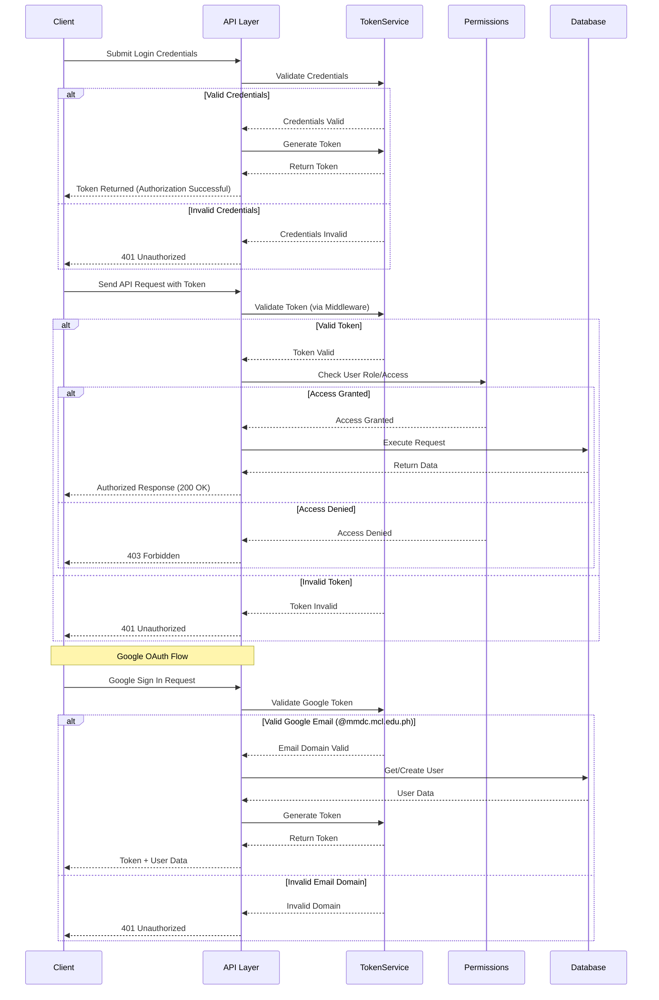

# Authentication and Authorization Flow Diagram

## Authentication Flows

### Regular Authentication
1. User can authenticate through:
   - Login form (username/password)
   - Signup form (create new account)
2. After successful authentication:
   - Generate authentication token
   - Create user session
   - Return token and user data

### Google OAuth2 Authentication
1. User clicks Google Sign In button
2. Redirected to Google login page
3. After Google authentication:
   - Get Google OAuth2 token
   - Verify token on server
   - Check email domain (@mmdc.mcl.edu.ph only)
   - Get existing user or create new one
   - Generate authentication token
   - Create user session
   - Return token and user data

### Token Authentication (API)
1. Client includes token in Authorization header
2. Server verifies token for each API request
3. Grant or deny access based on token validity

### Session Authentication (Web)
1. Server creates session after authentication
2. Client receives session cookie
3. Client includes cookie in subsequent requests
4. Server verifies session for each web request
5. Grant or deny access based on session validity

## Security Measures

1. Password Requirements:
   - Minimum 8 characters
   - At least one uppercase letter
   - At least one lowercase letter
   - At least one number
   - At least one special character

2. Email Restrictions:
   - Google OAuth limited to @mmdc.mcl.edu.ph domain
   - Email verification required

3. Token Security:
   - Unique per user
   - Included in Authorization header
   - Required for all API endpoints (except login/signup)

4. Session Security:
   - Secure cookie flags
   - HTTPS only
   - Session timeout
