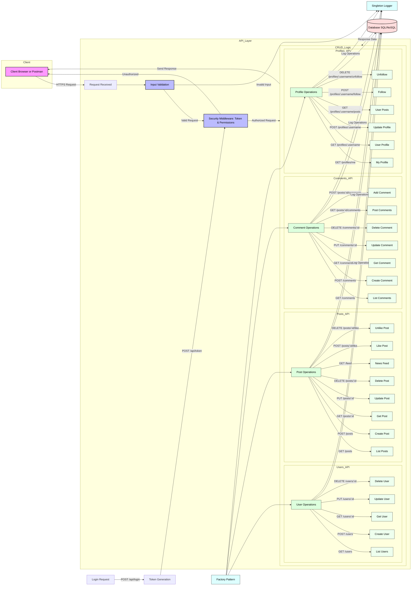

# API CRUD Interaction Flow Diagram

## API Endpoints Summary

### Authentication
- `POST /api/login/` - User login
- `POST /api/token/` - Obtain authentication token

### Users
- `GET /api/users/` - List all users
- `POST /api/users/` - Create new user
- `GET /api/users/{id}/` - Get user details
- `PUT /api/users/{id}/` - Update user
- `DELETE /api/users/{id}/` - Delete user

### Posts
- `GET /api/posts/` - List all posts
- `POST /api/posts/` - Create new post
- `GET /api/posts/{id}/` - Get post details
- `PUT /api/posts/{id}/` - Update post
- `DELETE /api/posts/{id}/` - Delete post
- `POST /api/posts/{id}/like/` - Like a post
- `DELETE /api/posts/{id}/like/` - Unlike a post
- `GET /api/feed/` - Get personalized news feed

### Comments
- `GET /api/comments/` - List all comments
- `POST /api/comments/` - Create new comment
- `GET /api/comments/{id}/` - Get comment details
- `PUT /api/comments/{id}/` - Update comment
- `DELETE /api/comments/{id}/` - Delete comment
- `GET /api/posts/{id}/comments/` - Get comments for a post
- `POST /api/posts/{id}/comments/` - Add comment to a post

### Profiles
- `GET /api/profiles/me/` - Get own profile
- `GET /api/profiles/{username}/` - Get user profile
- `POST /api/profiles/{username}/` - Update profile
- `GET /api/profiles/{username}/posts/` - Get user's posts
- `POST /api/profiles/{username}/follow/` - Follow user
- `DELETE /api/profiles/{username}/unfollow/` - Unfollow user
