# System Architecture Diagram

```mermaid
graph TB
    subgraph Client Layer
        WebClient[Web Client]
        APIClient[API Client]
    end

    subgraph Application Layer
        subgraph Authentication
            AuthService[Authentication Service]
            GoogleOAuth[Google OAuth Service]
            TokenManager[Token Manager]
            SessionManager[Session Manager]
        end

        subgraph Core Services
            PostService[Post Service]
            CommentService[Comment Service]
            UserService[User Service]
            ProfileService[Profile Service]
            FeedService[Feed Service]
            MediaService[Media Service]
        end

        subgraph Common Components
            direction TB
            LoggerSingleton[Logger Singleton]
            ConfigManager[Config Manager]
            PostFactory[Post Factory]
            Permissions[Permission Manager]
        end
    end

    subgraph Data Layer
        DB[(Database)]
        FileStorage[File Storage]
    end

    subgraph External Services
        GoogleAuth[Google Auth API]
    end

    %% Client to Application Layer connections
    WebClient -->|HTTP/HTTPS| AuthService
    WebClient -->|HTTP/HTTPS| PostService
    WebClient -->|HTTP/HTTPS| FeedService
    APIClient -->|REST API| AuthService
    APIClient -->|REST API| PostService
    APIClient -->|REST API| FeedService

    %% Authentication flow
    AuthService -->|Verify| GoogleOAuth
    GoogleOAuth -->|OAuth2| GoogleAuth
    AuthService -->|Generate| TokenManager
    AuthService -->|Create| SessionManager
    
    %% Core services interactions
    PostService -->|Create/Read/Update/Delete| DB
    CommentService -->|CRUD Operations| DB
    UserService -->|User Management| DB
    ProfileService -->|Profile Data| DB
    FeedService -->|Aggregate Data| PostService
    FeedService -->|User Data| UserService
    MediaService -->|Store Files| FileStorage

    %% Common components usage
    PostService -->|Use| LoggerSingleton
    CommentService -->|Use| LoggerSingleton
    AuthService -->|Use| LoggerSingleton
    PostService -->|Create Posts| PostFactory
    FeedService -->|Config| ConfigManager
    PostService -->|Check| Permissions
    CommentService -->|Check| Permissions

    classDef clientLayer fill:#f9f,stroke:#333,stroke-width:2px,color:#000
    classDef serviceLayer fill:#bbf,stroke:#333,stroke-width:2px,color:#000
    classDef dataLayer fill:#dfd,stroke:#333,stroke-width:2px,color:#000
    classDef externalLayer fill:#fdd,stroke:#333,stroke-width:2px,color:#000
    classDef commonLayer fill:#ffd,stroke:#333,stroke-width:2px,color:#000

    class WebClient,APIClient clientLayer
    class AuthService,GoogleOAuth,TokenManager,SessionManager,PostService,CommentService,UserService,ProfileService,FeedService,MediaService serviceLayer
    class DB,FileStorage dataLayer
    class GoogleAuth externalLayer
    class LoggerSingleton,ConfigManager,PostFactory,Permissions commonLayer
```

## System Components

### Client Layer
- **Web Client**: Browser-based interface
- **API Client**: REST API consumer (mobile apps, external services)

### Application Layer

#### Authentication Services
- **Authentication Service**: Handles user authentication and authorization
- **Google OAuth Service**: Manages Google OAuth2 authentication flow
- **Token Manager**: Handles JWT/auth token generation and validation
- **Session Manager**: Manages user sessions for web interface

#### Core Services
- **Post Service**: Manages post creation, updates, and deletion
- **Comment Service**: Handles post comments
- **User Service**: User management and profile data
- **Profile Service**: User profile operations
- **Feed Service**: Aggregates and delivers personalized content
- **Media Service**: Handles media file uploads and storage

#### Common Components
- **Logger Singleton**: Centralized logging service
- **Config Manager**: Application configuration management
- **Post Factory**: Implements factory pattern for post creation
- **Permission Manager**: Handles role-based access control

### Data Layer
- **Database**: PostgreSQL database for persistent storage
- **File Storage**: File system for media storage

### External Services
- **Google Auth API**: External authentication provider

## Design Patterns Used

1. **Singleton Pattern**
   - Logger implementation
   - Configuration management
   - Ensures single instance for system-wide services

2. **Factory Pattern**
   - Post creation through PostFactory
   - Standardizes object creation process

3. **Observer Pattern**
   - Used in feed updates
   - Notification system

4. **Repository Pattern**
   - Data access abstraction
   - Separation of business logic from data access

## Data Flow

1. **Authentication Flow**
   - Client → Authentication Service → Google OAuth/Database
   - Token/Session generation and validation

2. **Post Operations**
   - Client → Post Service → Permission Check → Database
   - Media handling through MediaService

3. **Feed Generation**
   - Client → Feed Service → Post/User Services → Database
   - Aggregation and personalization

4. **Logging Flow**
   - All Services → Logger Singleton → Log Storage

5. **Configuration**
   - All Services → Config Manager → Configuration Data

## Security Measures

1. **Authentication**
   - Token-based API authentication
   - Session-based web authentication
   - OAuth2 integration

2. **Authorization**
   - Role-based access control
   - Permission verification for all operations

3. **Data Protection**
   - Secure file storage
   - Database security
   - HTTPS communication
